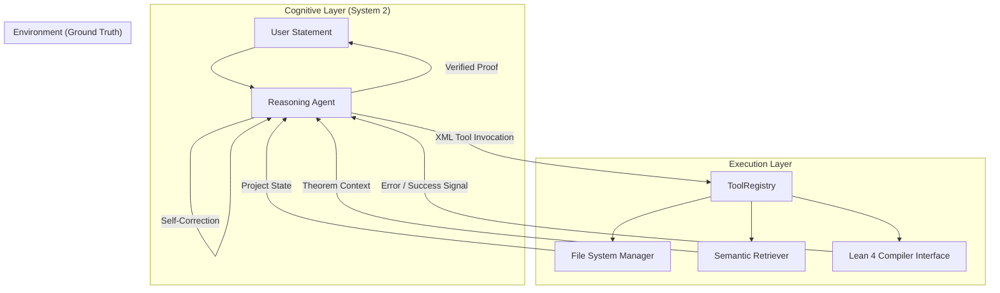

<div align="center">


### **The Autonomous Runtime for Formal Verification & Mathematical Reasoning**

[](https://github.com/chunjiang/jiuzhao)
[](https://leanprover.github.io/)
[](https://www.python.org/)

<p align="center">
  
</p>

[Vision](#-vision) • [Core Technology](#-core-technology) • [Architecture](#-architecture) • [Quick Start](#-quick-start) • [Roadmap](#-roadmap)

</div>

---

## 🔭 Vision

While Large Language Models (LLMs) excel at probabilistic generation, they struggle with deterministic correctness. In software engineering and mathematics, "almost correct" is synonymous with "wrong."

**Jiuzhao** is not merely a copilot; it is an autonomous agentic framework designed to operate within the strict constraints of Formal Mathematics (Lean 4). By treating the Lean compiler as an absolute source of truth, Jiuzhao implements a rigorous **Reasoning-Action-Verification loop**.

Think of Jiuzhao as "Claude Code" for rigorous logic. It does not just predict the next token; it hypothesizes proofs, attempts verification, analyzes compiler errors, and iteratively self-corrects until mathematical truth is established.

---

## 🧠 Core Technology

Jiuzhao moves beyond simple prompt engineering, implementing a robust **System 2** reasoning architecture for automated theorem proving.

### 1. The Compiler-Feedback Reinforcement Loop
Unlike standard coding assistants that output static text, Jiuzhao operates dynamically. It engages in a continuous conversation with the **Lean Compiler**:
*   **Generation:** The LLM proposes a tactic or proof strategy.
*   **Verification:** The code is compiled against `Mathlib`.
*   **Correction:** If compilation fails, the error message is fed back into the context. The agent analyzes the logical gap—whether it's a type mismatch, a missing hypothesis, or a hallucinated theorem—and rectifies it autonomously.

### 2. Semantic Context & Library Retrieval
Formal mathematics requires precise alignment with existing definitions. Jiuzhao integrates a semantic search engine that:
*   Navigates the massive **Mathlib** dependency graph.
*   Retrieves relevant lemmas and theorems based on semantic similarity, not just keyword matching.
*   Ensures the agent "knows" the axioms available to it, reducing hallucination of non-existent theorems.

### 3. Model-Agnostic Inference Layer
Jiuzhao is architected for the future of inference. It decouples the reasoning logic from the underlying model, supporting:
*   **SOTA Frontier Models:** GPT-4o, Claude 3.5 Sonnet, DeepSeek Reasoner (R1).
*   **Local Privacy-First Models:** Llama 3, RWKV-7-Prover (via Ollama) for secure, offline deployment.

---

## 🏗️ Architecture

The system follows a modular Agent-Tool-Environment design pattern, ensuring scalability and observability.



*   **Agent Core (`jiuzhao/core`)**: Manages the context window, ReAct (Reason+Act) traces, and XML parsing for tool invocation.
*   **Toolchain (`jiuzhao/tools`)**: Provides the agent with "hands" to manipulate the file system and interact with the Lean runtime environment.
*   **Feedback Mechanism**: The critical differentiator. The compiler's output is treated as a deterministic reward signal.

---

## ⚡ Installation & Setup

Jiuzhao is designed for researchers and engineers who demand precision.

### Prerequisites
*   **Python 3.9+**
*   **Lean 4 & Lake**: The standard build system for the Lean theorem prover.
*   **Poetry**: For deterministic dependency management.

### Deployment

```bash
git clone https://github.com/imbue-bit/Jiuzhao/
cd jiuzhao

poetry install

poetry shell
```

---

## 🚀 Quick Start: The Proving Loop

### 1. Configuration
Initialize the agent and select your inference backend.

```bash
jiuzhao config
```
*The interactive setup allows you to define temperature (precision vs. creativity), context limits, and API endpoints.*

### 2. Autonomous Proving
Launch the agent with a formal statement or a natural language conjecture.

```bash
jiuzhao prove "Prove that the set of prime numbers is infinite."
```

**System Behavior:**
1.  **Initialization**: Jiuzhao scaffolds a new `.lean` environment and imports necessary `Mathlib` modules.
2.  **Hypothesis**: It formulates the theorem (e.g., `theorem infinitude_of_primes : ...`).
3.  **Iteration**:
    *   *Attempt 1*: Writes a proof using Euclid’s argument.
    *   *Check*: Lean compiler reports a missing tactic import.
    *   *Attempt 2*: Agent reads error, adds `import Mathlib.Data.Nat.Prime`, and refines the tactic.
    *   *Check*: Compiler returns `Goals accomplished`.
4.  **Finalization**: The verified proof is saved and presented to the user.

---

## 🤝 Contributing

We are building the foundation for **AI-assisted mathematical discovery**. We welcome contributions from:
*   **Formal Verification Engineers**: To expand the toolset for Lean 4.
*   **ML Researchers**: To optimize the prompting strategies and context retrieval.
*   **Mathematicians**: To stress-test the agent with complex topology and algebra problems.

Please refer to `CONTRIBUTING.md` for our architectural standards and pull request protocols.

---

<div align="center">

Built with ❤️ for the Math & AI Community.

</div>
